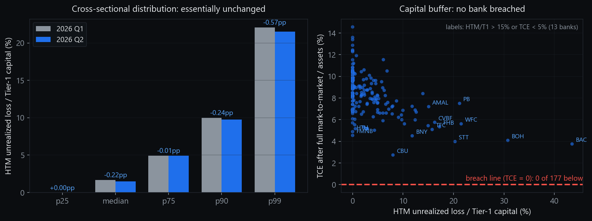
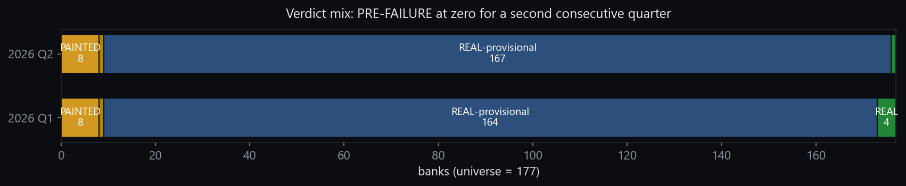
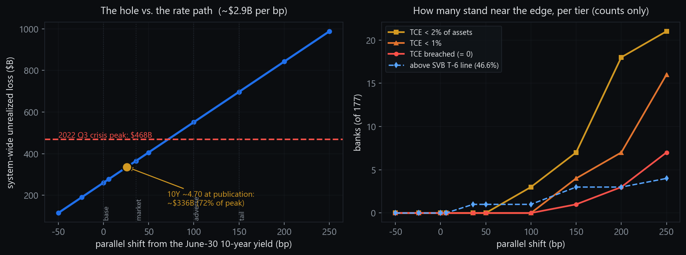
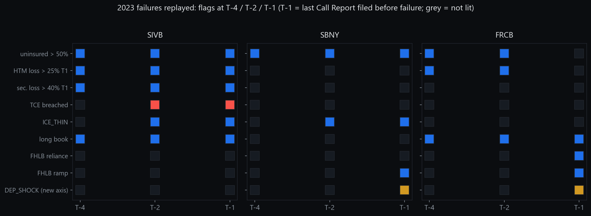
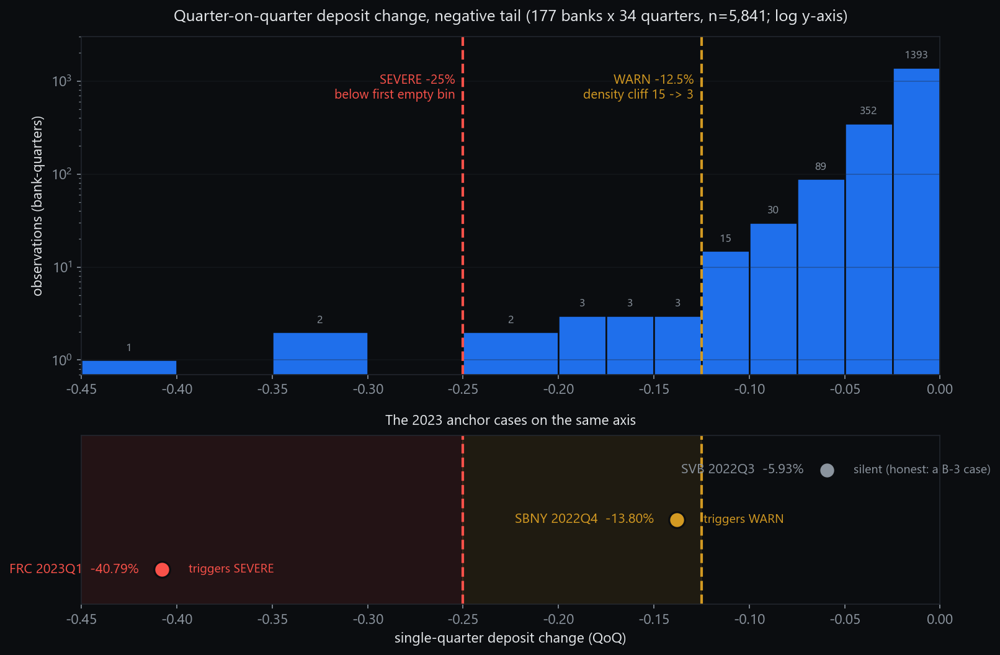

> Machine-readable version; PDF of record available from the author.

# Painted or Real? Reading 177 Listed U.S. Banks Against Their Own Regulatory Filings (2026 Q2)

**William Wei** · Independent Researcher · Chicago · September 2026

---

## Abstract

This study measures 177 listed U.S. banks and consumer-credit institutions against their own quarterly regulatory filings (Call Reports), as of the quarter ended June 30, 2026. Every figure is computed from free public data — primarily the FDIC's BankFind Analytics API — and every classification rule is stated with its threshold before any result is presented. Six results follow. First, the system-wide unrealized loss on the 177 banks' $4.52 trillion securities book stands at $260.2 billion; after marking every bond to market and pushing the full loss into capital, **zero of 177 banks** breach tangible common equity — for the second consecutive quarter. Second, a ten-tier yield-gradient stress panel (Section 3.6) measures how fast that cushion thins as rates move: roughly $2.9 billion of additional unrealized loss per basis point of parallel shift; at the ~4.70% where the ten-year yield actually traded at publication the loss interpolates to about $336 billion — 72% of its 2022 crisis peak — the peak itself is exceeded near +100 basis points, and a first capital breach appears only beyond +150 basis points. Third, the cross-sectional distribution of held-to-maturity losses relative to Tier-1 capital is essentially unchanged quarter on quarter, but the composition beneath the stable headline rotated: the count of banks carrying both a deep securities loss and a leaking deposit base held at 11, while 5 of the 11 names changed. Fourth, a headline this study itself published a quarter ago — a widening of deposit-decline breadth from 52 to 82 banks — is demoted here by its own seasonal baseline: the same Q1-to-Q2 jump occurred in 2024 (+42) and 2025 (+36), and this year's (+30) is the smallest of the three. Fifth, eight banks carry the technical classification PAINTED — reported profitability concurrent with reserve-account patterns such as provisioning below net charge-offs for three or more consecutive quarters. Sixth, the measuring instrument itself is audited in public: the framework is replayed against the three 2023 bank failures, a blind spot it missed (First Republic's final quarter) is documented, and the repair — a deposit-shock axis whose thresholds are derived from gaps in the empirical distribution of 5,841 bank-quarters — is validated on both positive and live populations. Falsifiable predictions, each testable against the quarter-ended-September-30 Call Reports due in late November, are stated.

---

## 1. Introduction

Banks are the most heavily instrumented industry in the American economy. Every FDIC-insured institution files a quarterly Report of Condition and Income — the Call Report — containing over two thousand fields: security-by-maturity schedules, deposit compositions, loan-loss reserves against actual charge-offs, borrowings from the Federal Home Loan Bank system. All of it is public, machine-readable, and free.

The question this study asks is whether a bank's headline earnings survive being read against that raw material. A quarter of strong reported earnings can be **REAL** — cash-generative, conservatively reserved, honestly funded. It can be **PAINTED** — a technical classification defined in Section 2.4, meaning the reported profitability coincides with measurable reserve-account support, such as provisioning persistently below net charge-offs. Or, in the limit, it can be **PRE-FAILURE** — a balance sheet whose tangible common equity would not survive marking its securities to market. The 2023 regional-bank failures demonstrated that the third category exists and that its symptoms were visible in regulatory data quarters in advance [6][7][8].

Two design choices distinguish this exercise from commentary. The first is that the measurement machine is audited in public: Section 4 replays the framework against Silicon Valley Bank, Signature Bank, and First Republic, reports where it succeeded and where it was blind, and derives its newest indicator from the documented blind spot. The second is that the study binds itself to falsifiable predictions (Section 5), each testable against the next quarterly filing cycle.

The exercise is observational. It reports what disclosed data show. It contains no investment advice, no trading signals, and no forecast of any security's price. **PAINTED is not an allegation of misstatement or wrongdoing** — every underlying figure comes from the bank's own regulatory filing, and the classification describes an arithmetic pattern, not an intent.

---

## 2. Data and Methodology

The credibility of this study rests on its definitions, not its conclusions. This section states the data sources, the entity-resolution discipline, the indicator definitions with thresholds, the verdict rules, the validation regime, and the known limitations — all before any finding.

### 2.1 Universe

The universe is 177 listed U.S. banking and consumer-credit institutions: the constituents of the Invesco KBW Bank ETF (29 large and super-regional names) plus the SPDR S&P Regional Banking ETF (163 regional names), de-duplicated, plus listed card issuers that sit outside both ETFs [9]. Pure payment networks (Visa, Mastercard) are excluded — they carry no balance-sheet credit risk. Institutions are grouped into three tiers (money-center/GSIB and super-regional; regional; card issuer) with a `[TRUST]` sub-tag for custody banks, because different business models die of different diseases and must be read with different priority orders.

### 2.2 Data sources

| Source | Use | Basis |
|---|---|---|
| FDIC BankFind Analytics API [1] | All balance-sheet and income indicators (free REST, no key) | Point-in-time by report date (REPDTE); 2,378-field dictionary |
| FFIEC Central Data Repository [2] | Call Report original schedules, coverage verification | Bulk per-period files |
| FFIEC NIC / NPW attribute files [3] | Entity resolution (CUSIP-to-RSSD welding) | Public bulk download |
| U.S. Treasury daily yield curve [4] | Reference-yield side notes only (never enters a verdict) | Official daily series |
| Federal Reserve H.8 [5] | External order-of-magnitude anchor for one aggregate | Weekly system-wide |

Three data-handling rules matter enough to state up front:

- **Income items are year-to-date and must be differenced.** Call Report flow items (provisions, charge-offs) are cumulative within the calendar year. Discrete quarters are recovered by differencing consecutive filings; without this step every second-half ratio is systematically overstated.
- **One ticker is not one charter.** Fourteen of the 177 listed holding companies operate multiple insured charters; one operates sixteen, and its lead charter holds only 12.8% of consolidated assets. All measurements aggregate over the full certificate set of each holding company. A completeness gate raises an error if two tickers ever claim the same certificate.
- **Entities are welded by CUSIP, not by name.** ETF constituent names arrive truncated and uppercased; name matching confused three distinct "Bancorp"-named institutions in testing. The production path maps issuer CUSIP roots to regulator identifiers; in the nine cases where the name path and the CUSIP path disagreed, the CUSIP path was correct nine times out of nine.

### 2.3 Indicator definitions

**(i) Securities-loss-to-capital family ("the ice").** For each institution: unrealized loss on held-to-maturity securities (amortized cost minus disclosed fair value) as a fraction of Tier-1 capital (`HTM loss / T1`); the same ratio including available-for-sale losses (`(HTM+AFS) loss / T1`); and the acid test —

> **TCE distance = tangible common equity after deducting the full unrealized loss on both books, divided by total assets.**

A bank with TCE distance ≤ 0 has a balance sheet that does not survive its own disclosures being marked to market; this is the `TCE_WIPED_BY_SEC_LOSS` flag and the direct trigger of the PRE-FAILURE verdict. Both single-basis and dual-basis ratios are always reported with explicit suffixes, because the two answer different questions and mixing them mid-argument is a classic source of phantom discrepancies.

**(ii) Duration proxy.** Call Report Schedule RC-B Memorandum items report the securities book in remaining-maturity/repricing buckets; bucket midpoints against a **fixed reference yield of 4.50%** yield a portfolio duration proxy. The reference yield is deliberately constant across quarters: a baseline that drifts with the market re-ranks banks that did nothing, and quarter-on-quarter readings would then mix rate moves into bank behavior. The actual market yield is carried as a side-note column and never enters a verdict. Bucket coverage was verified at 100.00% of the bond book for all 177 institutions. A known bias is disclosed rather than calibrated away: one memorandum item has only two buckets, so the proxy systematically understates duration for banks concentrated there (55 institutions carry a `DURATION_UNDERSTATED` flag). Calibrating the proxy against the unrealized loss it is meant to explain would be circular, and is refused.

**(iii) Deposit legs.** Two complementary reads of the same series. *Persistence*: the count of consecutive quarters of negative quarter-on-quarter deposit growth. *Magnitude*: the new `DEP_SHOCK` axis (Section 4.2), flagging any single-quarter decline beyond −12.5% (WARN) or −25% (SEVERE) — thresholds derived from gaps in the empirical distribution, not chosen by hand. The composite structural flag is

> **ICE_THIN = (deposit streak ≥ 2 quarters) AND (HTM loss / T1 > sample median),**

a deep asset-side hole co-occurring with a leaking liability side — the two-legged configuration that distinguished 2023's failures from banks that merely held underwater bonds.

**(iv) Earnings-quality family.** `PROV_LT_NCO_xQ`: loan-loss provisions below net charge-offs for x ≥ 3 consecutive quarters — reported earnings are being supported by drawing down the reserve, i.e., **the EPS is borrowed**. A conditioner suppresses the flag where reserve levels independently justify releases, to avoid punishing genuinely over-reserved banks. `COVERAGE_THIN`: allowance for credit losses below 1.0× nonperforming loans (including non-accruals in the denominator). `RESERVE_RELEASE_DRIVEN`: negative provisioning that is itself the profit driver.

**(v) Funding family.** `UNINSURED_HIGH`: uninsured deposits above 50% of deposits — a prior on exit velocity, not a defect per se. FHLB reliance and ramp: measured on **four-quarter averages with a year-over-year gate**, never single-quarter changes — the raw series contains overnight positions and one bank's advances moved $900M → 0 → $1.4B → $50M → $1.75B across five quarters; a naive quarter-on-quarter threshold lit 18 banks, all noise.

**(vi) The side door.** Loans to non-depository financial institutions (`LNNDEPD`) — the channel through which private-credit and fund-finance risk enters the regulated perimeter. The field is domestic-office only, so large banks' true exposure is understated; the measured aggregate ($1.47 trillion as of Q1 2026, 10.7% of all loans in-universe) is the same order as the Federal Reserve's H.8 system-wide series, which anchors the sensor without claiming precision [5].

**(vii) Proxy honesty.** Commercial-real-estate concentration is computed as a proxy that cannot exclude owner-occupied property and is therefore systematically high; it carries a `_proxy` suffix, is used only for within-sample ranking, and is never quoted as an absolute level against regulatory thresholds. Every column with this limitation carries the suffix in the released tables.

### 2.4 Verdict rules

Verdicts are produced by fixed rules, not judgment calls, and the rules are stated here in full:

- **PRE-FAILURE**: TCE distance ≤ 0 (the balance sheet does not survive its own marks).
- **PAINTED**: the institution is on the *honor roll* (top peer-relative reported performance) **and** carries at least one Group-A earnings-quality flag (Section 2.3(iv)). The logic is deliberate: the better the reported quarter, the more scrutiny its estimate accounts receive. An honor-roll bank whose strong earnings coincide with provisioning below charge-offs has, arithmetically, borrowed part of those earnings from its reserve.
- **PAINTED\***: same pattern where a structural explanation specific to the business model (e.g., broker-dealer accounting) is plausible but unresolved; held for species-specific review.
- **REAL**: honor roll with zero flags of any kind.
- **REAL-provisional**: everything else. This is a **neutral** state — "the screen did not trigger," which is not the same as "clean."

One consequence of this design is disclosed because it moves names between categories without any change in their data: entering or leaving the honor roll changes how existing evidence is judged. This quarter one bank entered PAINTED with no new flags — it entered the honor roll, and evidence it already carried was re-read under the stricter standard. Three banks left REAL for REAL-provisional without any deterioration — they left the honor roll on peer-relative rank. Section 3.4 labels every such move.

**Terminology note (recorded openly, not silently replaced).** This edition (2026 Q2) uses the label PAINTED. Beginning with the 2026 Q3 edition, the public label becomes **RESERVE-SUPPORTED** (and **RESERVE-SUPPORTED (structural review)** for PAINTED\*). Definitions, thresholds, and rules are unchanged; the rename is for terminology neutrality — a purely descriptive label in place of one whose metaphor could be read as implying intent. The change is applied at the publication layer only; the internal engine, its case law, and its regression fixtures retain the original label so that every historical result remains reproducible under one name. This note exists so the rename is on the record and cannot be mistaken for a retreat from the classification itself.

### 2.5 Validation regime

- **Regression anchor.** Any change to the calculation or flag layer must replay the five-quarter Silicon Valley Bank history and reproduce the frozen baseline before it can merge. Single-name replays must use the full-sample peer cutpoints from the same historical quarter — sample-relative thresholds degenerate when the sample is one bank (the median becomes the bank itself), which produces false failures.
- **Positive fixtures.** The three 2023 failure cases are frozen as regression fixtures with content hashes, and the fixture fingerprint is tied to the engine version that produced it (an early fingerprint recorded against a stale engine hash was caught and re-frozen — fingerprints that don't name their engine are decorative).
- **Pre-registration.** The sensitivity exercise in Section 4 registered its hypotheses, thresholds, and pass/fail criteria in a hashed document before the engine ran.
- **External anchors.** The engine's SVB-quarter readings were reconciled against SVB's own 10-K disclosures ($91.3B HTM, $76.2B fair value, $15.1B unrealized loss) with all deviations below 0.5% [10].
- **Render integrity.** Published tables pass row-conservation and cell-overflow gates; both guards exist because each once caught a silent content-loss bug that produced a well-formed, complete-looking, wrong document.

### 2.6 Known limitations (stated up front, not in an appendix)

**Mandate boundary (fixed clause, reproduced in every publication of this framework).** This framework measures funding pressure — the gradient of solvency erosion and fragile configurations — **not bank runs** (liability-side behavior and ignition timing). Three corollaries: (i) unrealized losses do not kill a bank directly; *forced realization* does, and the ignition source sits on the liability side, outside the observation range of quarterly regulatory data; (ii) the deposit-shock axis is an after-the-fact measurement of liability-side outcomes already visible in a quarterly snapshot — it is not a run predictor; (iii) every "the buffer holds" reading in this framework therefore carries an implicit no-ignition premise, and that premise cannot be verified by this instrument.

- **B-1 — Loan-book duration.** The unrealized-loss axis covers the securities book only. First Republic's interest-rate risk sat substantially in long jumbo mortgages; a loan-book duration proxy is computed but not yet wired into any flag.
- **B-2 — Deposit composition.** Call Reports do not disclose depositor industry or single-source concentration. Signature's crypto-deposit concentration is invisible in this data at any threshold. Structural; cannot be built from this source.
- **B-3 — The 91-day shutter.** Call Reports are quarterly snapshots. A run that begins and ends inside a quarter — Silicon Valley Bank lost $42 billion in one day, three months after its last filing — is physically invisible. **This instrument measures who is fragile, not who is dying.** Week-level run detection is not a job a quarterly instrument can hold.
- **Small positive sample.** The out-of-sample sensitivity estimate rests on n = 2 failure cases (Section 4.1). It is a point estimate with an extremely wide interval and is reported as such, not as a performance metric.
- **Survivor bias in specificity.** The false-positive control population is today's 177 banks replayed into the past — banks that failed are absent from it, so measured specificity is, if anything, overstated.
- **Verdicts are a coarse screen.** All verdicts are first-pass classifications from regulatory data alone and can be overturned by filing-level review of any individual name.

---

## 3. Findings

This section states what the disclosed data show. It does not attribute motive.

### 3.1 The ice: $260 billion of unrealized losses, zero capital breaches

Across the 177 institutions, the securities book totals $4,517.5 billion at amortized cost, carrying $260.2 billion of unrealized losses ($259.5 billion last quarter). Marking every bond to market and deducting the full loss from capital, **no institution's tangible common equity goes to zero — for the second consecutive quarter.** The cross-sectional distribution barely moved:

**Table 1. HTM unrealized loss / Tier-1 capital, cross-sectional distribution.**

| Percentile | 2026 Q1 | 2026 Q2 | Change |
|---|---|---|---|
| p25 | 0.0% | 0.0% | +0.00pp |
| median | 1.7% | 1.5% | −0.22pp |
| p75 | 4.9% | 4.9% | −0.01pp |
| p90 | 10.0% | 9.8% | −0.24pp |
| max | 43.0% | 43.5% | +0.52pp |

*Figure 1. Left: the distribution did not move. Right: the capital buffer test — 0 of 177 below the breach line.*

For calibration against the last crisis: measured on the same universe with the same method, the system-wide unrealized loss peaked at $468 billion in 2022 Q3; today's level is roughly 55% of that peak. And the largest single reading today — 43.5% of Tier-1 — sits below where Silicon Valley Bank stood **six quarters before it failed** (46.6% in 2022 Q1, on its way to 93.9%).

One reading matters for how this table should *not* be used: the bank at the top of the ice ranking is there because its HTM book is 2.7× its Tier-1 capital, not because its portfolio is unusually long — its duration proxy is below that of 44 other banks. **Duration is not the danger axis; book-to-capital ratio is.** The 2023 replay (Section 4.1) confirms this: Silicon Valley Bank's duration ranked 34th of 178 in its own quarter — unremarkable — while its loss-to-capital ratio ranked first by a factor of 1.5 over second place.

### 3.2 The deposit leg: a headline demoted by its own baseline

Last quarter this framework concluded that the 2023 failure configuration "has only one leg": asset-side losses were real, but the liability side showed no systemic deterioration. This quarter's raw read appeared to change that:

| Measure | 2026 Q1 | 2026 Q2 |
|---|---|---|
| Banks with deposit QoQ negative ≥ 1 quarter | 52 | 82 |
| Banks with deposit QoQ negative ≥ 2 quarters | 20 | 22 |
| ICE_THIN (streak ≥ 2 **and** HTM/T1 > median) | 11 | 11 |

An earlier draft of this study's internal report wrote the 52 → 82 widening up as the quarter's largest distributional shift. **A seasonal baseline check demoted it.** Computing the identical measure, on the identical universe, with the identical engine, for the two prior years:

**Table 2. Q1→Q2 jump in deposit-decline breadth, three years.**

| Year | Q1 count | Q2 count | Jump | Ratio |
|---|---|---|---|---|
| 2024 | 57 | 99 | +42 | 1.74× |
| 2025 | 43 | 79 | +36 | 1.84× |
| **2026** | **52** | **82** | **+30** | **1.58×** |

The Q1-to-Q2 widening is a seasonal regularity — and this year's is the *smallest* of the three. The ≥ 2-quarter streak count moved +11, +3, +2 across the same years. The demoted headline is retained in the text deliberately, as a worked example of the discipline this study commits to: **a breadth headline must face its own seasonal baseline before it is allowed to mean anything.** The condition under which it is reinstated is registered in Section 5 (P1): in every recent year the breadth falls back from Q2 to Q3; if this year's does not, the signal is real and this study said so in advance.

What survives the seasonal correction is compositional. The ICE_THIN count held at 11, but **five of the eleven names rotated**† (entering: BOH, RRBI, SHBI, UMBF, WABC; exiting: BUSE, CVBF, INDB, KEY, UVSP) — and name churn is not subject to the Q1→Q2 seasonal artifact, because the flag conditions on a two-quarter streak *and* an above-median loss ratio simultaneously.

### 3.3 Convergence toward the 2022 Q3 reference profile

The replay in Section 4.1 froze a three-axis reference profile from Silicon Valley Bank's last-but-two filing (2022 Q3, six months before failure): **HTM loss / T1 = 93.9% · deposit streak = 2 quarters · uninsured share = 86.8%.** Convergence requires movement on *all three* axes — the replay showed that two banks matched on two axes in 2022 and the one that survived was separated by the third (uninsured 42.5% vs. 86.8%).

**Table 3. The ten deepest ice readings against the reference profile, 2026 Q2.†**

| # | Ticker | HTM/T1 | % of reference | Deposit streak | Uninsured share | Direction vs. Q1 |
|---|---|---|---|---|---|---|
| 1 | BAC | 43.5% | 46.3% | 1 qtr | 42.2% | approaching |
| 2 | BOH | 30.8% | 32.8% | **2 qtrs** | 47.2% | approaching |
| 3 | WFC | 21.5% | 22.9% | 0 | 50.0% | approaching |
| 4 | PB | 21.2% | 22.6% | 1 qtr | 42.7% | receding |
| 5 | STT | 20.3% | 21.6% | 0 | 75.9% | receding |
| 6 | FHB | 17.2% | 18.3% | 1 qtr | 48.4% | receding |
| 7 | CVBF | 16.3% | 17.3% | 0 | 54.2% | receding |
| 8 | TFC | 15.8% | 16.8% | 0 | 44.9% | receding |
| 9 | AMAL | 15.1% | 16.1% | 0 | 57.1% | approaching |
| 10 | USB | 15.0% | 15.9% | 0 | 52.2% | receding |

**Banks meeting a two-axis convergence test (≥ 50% of the reference loss ratio and streak ≥ 2): zero.** The single name worth stating plainly is BOH† (Bank of Hawaii): it has carried the second-deepest loss-to-capital ratio for six quarters, and this quarter its deposit streak reached two — the configuration acquired its second leg on one bank. Its third axis (uninsured 47.2%) remains far from the reference (86.8%), which is precisely why the reference card keeps three axes. This is a watch item, not a prediction of distress.

### 3.4 Verdicts: eight PAINTED, one REAL, and an honest accounting of why names moved

*Figure 2. Verdict mix across the 177-bank universe, Q1 → Q2.*

| Verdict | 2026 Q1 | 2026 Q2 |
|---|---|---|
| PRE-FAILURE | 0 | 0 |
| PAINTED | 8 | 8 |
| PAINTED\* | 1 | 1 |
| REAL-provisional | 164 | 167 |
| REAL | 4 | 1 |

**Table 4. The PAINTED classifications, 2026 Q2, with the measured pattern behind each.**

> **† Note, applying to every name in this table and wherever this dagger appears:** PAINTED is a technical classification of arithmetic patterns in public filings, defined in Section 2.4. It alleges no misstatement, no wrongdoing, and no future outcome for any institution; every underlying figure is from the institution's own regulatory filing, and the classification is a first-pass screen that filing-level review can overturn.

| Ticker | Measured pattern (all from the institution's own Call Report) |
|---|---|
| BOH | Honor-roll earnings; HTM unrealized loss 30.8% of Tier-1 not reflected in regulatory capital; deposit streak 2 qtrs |
| FHN | Honor-roll earnings; provisions below net charge-offs for 5 consecutive quarters |
| FLG | Provisions below net charge-offs for 7 consecutive quarters; allowance below 1.0× nonperforming; elevated FHLB reliance; NBFI lending heavy and surging |
| HIFS | Honor-roll earnings; allowance below 1.0× nonperforming; elevated FHLB reliance |
| HTB | Provisions below net charge-offs for 5 consecutive quarters; allowance below 1.0× nonperforming |
| ORRF | Honor-roll earnings; provisions below net charge-offs for 3 consecutive quarters; FHLB ramp |
| OZK | Provisions below net charge-offs for 3 consecutive quarters; allowance below 1.0× nonperforming; construction-lending concentration (proxy); NBFI heavy |
| ZION | Honor-roll earnings; provisions below net charge-offs for 5 consecutive quarters |
| GS\* | Allowance and reserve-release patterns; broker-dealer accounting may explain structurally — held for species-specific review |

Churn†: three names entered PAINTED (HIFS, ORRF, OZK), three exited to neutral (BCAL, BHRB, KRNY). Per Section 2.4's disclosure, the moves decompose honestly: ORRF and OZK entered on **new flags** (fresh provision-below-charge-off streaks crossing the three-quarter threshold). **HIFS entered on no new flag** — it joined the honor roll, and its existing coverage evidence was re-judged under the stricter honor-roll standard. Symmetrically, BANF, CBC, and RRBI left REAL on peer-relative rank alone, with no deterioration in their own data. A classification system that conditions on excellence will reclassify banks when the definition of excellence moves; pretending otherwise would make the verdict table look more dynamic than the banks actually were.

The REAL tier — honor-roll performance with zero flags of any kind — narrowed to a single name (CHCO).

### 3.5 Two structural sensors, briefly

**The side door.** Lending to non-depository financial institutions stood at $1.47 trillion at the Q1 measurement — 10.7% of all loans in the universe, with 41 banks above 5% of their loan book and 32 banks growing the category faster than 30% year over year. The aggregate is the same order of magnitude as the Federal Reserve's system-wide H.8 series, which is what qualifies the sensor as real [5]. This is the channel through which private-credit stress would enter the regulated perimeter, and it is the structural bridge between this study and its companion work on private-credit vehicles.

**The consumer floor.** A hypothesis this framework brought into 2026 — that card-book deterioration was quietly diverging under a strong aggregate — **failed its test and is reported as failed.** Weighted card charge-offs across the 69 in-universe card books improved (4.67% → 4.05%); the high-versus-low-end spread was flat for two years; and monthly payment rates in six securitization master trusts (a fully independent disclosure channel) showed twelve-month slopes positive six-for-six. Two independent sources agree: the consumer end is not burning. No warning light is installed.

### 3.6 The yield-gradient stress panel: how fast the cushion thins

The zero-breach result of Section 3.1 is a single-point reading at the June-30 yield. Solvency is binary; susceptibility is continuous — and a framework that quotes only the binary number would have read Silicon Valley Bank as "fine" until the week it died, since its reported book equity never went negative. This framework therefore binds itself to a rule: **a zero in the breach column is never quoted alone**; it must appear beside its full gradient row.

**This section is an information layer: it adds range to the instrument, not verdicts.** No Q2 classification and none of the pre-registered predictions (P1–P8) are altered by anything in it.

The panel below re-marks every institution's own securities book under ten parallel yield shifts (linear duration approximation on each bank's disclosed maturity profile) and **replays the entire flag stack at each tier**, with sample-relative cutpoints recomputed per tier. Per this framework's publication rules, the public edition reports **counts only — no institution is named at any tier.** Scenario semantics: 0 = *base* (the filing-date snapshot); +36bp = *market* (a 4.80% ten-year, bracketing from above the ~4.70% where the ten-year actually traded at publication); +100bp = *adverse* (the zone where policy is forced to respond); +150bp and beyond = *tail dislocation*. **The far tiers price a moment of dislocation; they are not a forecast of a sustained state.**

Four boundaries, stated before the numbers: parallel shifts only, with no convexity (large-shift losses are understated); interest-rate hedges are invisible in Call Report data (hedged institutions are overstated); the duration proxy is understated for 55 institutions concentrated in a coarse-bucket disclosure item; and the deposit side is frozen at observed values — the rate paths that deepen the hole are the same paths that pressure funding costs and deposit retention, so **the liability side of this table is an optimistic boundary**. And per the mandate boundary of Section 2.6: every row here carries the no-ignition premise.

**Table 5. Ten-tier yield-gradient panel, 177 banks (counts only).**

| Shift | 10Y | Scenario | System loss ($B / % of 2022 peak) | HTM/T1 med · p90 · max | Above 46.6% / 93.9% | ICE_THIN | TCE <2% / <1% | Breached |
|---|---|---|---|---|---|---|---|---|
| −50bp | 3.94% | — | $115B (25%) | 0.3% · 7.0% · 34.9% | 0 / 0 | 11 | 0 / 0 | 0 |
| −24bp | 4.20% | — | $190B (41%) | 1.0% · 8.5% · 39.4% | 0 / 0 | 11 | 0 / 0 | 0 |
| 0 | 4.44% | base | $260B (56%) | 1.5% · 9.8% · 43.5% | 0 / 0 | 11 | 0 / 0 | 0 |
| +6bp | 4.50% | — | $278B (59%) | 1.6% · 10.1% · 44.5% | 0 / 0 | 12 | 0 / 0 | 0 |
| +36bp | 4.80% | market | $365B (78%) | 2.0% · 11.7% · 49.7% | 1 / 0 | 12 | 0 / 0 | 0 |
| +50bp | 4.94% | — | $406B (87%) | 2.3% · 12.4% · 52.1% | 1 / 0 | 12 | 0 / 0 | 0 |
| +100bp | 5.44% | adverse | $551B (118%) | 3.0% · 15.2% · 60.7% | 1 / 0 | 12 | 3 / 0 | 0 |
| +150bp | 5.94% | tail | $697B (149%) | 3.8% · 17.2% · 69.3% | 3 / 0 | 12 | 7 / 4 | 1 |
| +200bp | 6.44% | tail | $842B (180%) | 4.4% · 20.2% · 77.9% | 3 / 0 | 12 | 18 / 7 | 3 |
| +250bp | 6.94% | tail | $988B (211%) | 5.1% · 23.1% · 86.5% | 4 / 0 | 12 | 21 / 16 | 7 |

*Figure 5. The gradient, drawn: ~$2.9B per basis point, and the counts that must always accompany a breach number.*

Readings, in the required same-frame form. The system's sensitivity is roughly **$2.9 billion per basis point**. At the ~4.70% where the ten-year traded as this paper went to press — +26bp above the filing-date snapshot — linear interpolation on this grid puts the hole near **$336 billion, 72% of the 2022 crisis peak** (the amber point in Figure 5). One tier up, at *market* (+36bp, 4.80%), it reaches 78% and one institution crosses the 46.6% pre-warning line that Silicon Valley Bank crossed six quarters before failing. The 2022 peak itself is exceeded near the *adverse* tier. The first breach of tangible common equity appears at the +150bp tier, and at the deepest tier (+250bp, 10Y ≈ 6.94%) seven institutions breach, twenty-one hold less than 2% of assets in post-mark tangible equity, and no institution approaches the 93.9% death-state line. The ICE_THIN count barely moves across the grid (11 → 12) — by construction: it conditions on the *sample median*, which shifts with everyone, so it measures relative fragility, not absolute displacement; absolute displacement is what the other columns are for.

---

## 4. Auditing the Instrument

A measurement framework that only reports readings, and never reports where it is blind, cannot be trusted with the readings either. This section is the audit.

### 4.1 Replaying the 2023 failures

The engine was run, unmodified, on the historical Call Reports of the three 2023 failures — using each quarter's full 177-bank peer cutpoints, not today's — at three points before each failure (T-4, T-2, T-1 filings).

*Figure 3. The three failures light different flags — which is what correctness looks like, since they died of different diseases.*

- **Silicon Valley Bank** is nearly a full row: the loss-to-capital flags from T-2, capital breach at T-2 and T-1, uninsured, ICE_THIN. But SVB is the **design anchor** — the criteria were built from its autopsy — so its detection proves only that the engine is not broken. It is excluded from any sensitivity claim.
- **Signature Bank** is quasi-out-of-sample. Its securities-loss axes are **correctly silent** (its HTM losses were only 5–8% of Tier-1 — that was not its disease). It is caught on the funding side: uninsured concentration, a two-quarter deposit streak crossing ICE_THIN, an FHLB ramp, and (retroactively, Section 4.2) a deposit-shock WARN. The instrument caught the right bank *for the right reasons*.
- **First Republic** is the humbling case and the reason Section 4.2 exists. At its final filing, the engine's original liability-side flags were **all dark**: its uninsured-share flag had just *extinguished*, and its deposit streak was only one quarter. Only asset-side structure flags (long book, FHLB reliance and ramp) were lit.

Quasi-out-of-sample sensitivity is therefore **1 of 2** before the repair, with the n = 2 caveat of Section 2.6 attached in bold. Specificity has a sharper result: replaying all 177 present-day banks into 2022 Q3, the combination "capital breached + deposit streak" fired on exactly **one bank in 177** (0.6%) other than SVB itself — and that bank survived 2023. What separated it from SVB was the third axis: uninsured share 42.5% versus 86.8%. That single comparison is why the reference card in Section 3.3 carries three axes and why no two-axis match is ever reported as convergence.

### 4.2 DEP_SHOCK: deriving a threshold from a blind spot

**The autopsy.** First Republic's final Call Report shows deposits falling 40.79% in a single quarter ($176.4B → $104.5B). The engine saw nothing, for two mechanistic reasons worth stating in full because both generalize:

1. **Ratio semantics invert when numerator and denominator collapse together.** First Republic's uninsured-deposit *share* fell from 67.7% to 48.7% in its final quarter — extinguishing the uninsured flag — not because the bank got safer but because **the uninsured money was precisely the money that had already run**, leaving insured deposits and rescue inflows in the denominator. A falling risk-ratio during a run is the survivor-bias phenomenon expressed in accounting.
2. **A streak counter is magnitude-blind.** A −40.79% quarter and a −0.1% quarter are identical events to a consecutive-quarters counter.

**The repair.** A magnitude axis was added, with thresholds taken from the shape of the data rather than from judgment. Across 5,841 bank-quarter observations (177 banks × 34 quarters, 2018–2026): median quarterly deposit growth +1.17%; p1 = −7.54%; p0.1 = −17.75%; minimum −41.26%. The negative tail has two natural structures:

- a **density cliff** at −12.5%: the bin [−12.5%, −10%) holds 15 observations; the next bin holds 3 — a fivefold drop → **WARN = −12.5%**;
- the **first empty bin** at [−30%, −25%): zero observations in the entire history → **SEVERE = −25%**.

*Figure 4. The thresholds' entire justification, drawn: the density cliff at −12.5%, the empty bin below −25%, and the anchor cases.*

**Validation, both directions.**

| Test | Result |
|---|---|
| First Republic, final filing | **SEVERE** fires (−40.79%; live-population percentile 0.017%) — the blind spot is repaired |
| Signature, final filing | **WARN** fires (−13.80%) — an extra hit the pre-registration did not anticipate |
| Silicon Valley Bank, all three replay points | **Silent** (deepest quarter −5.93%) — and this silence is *correct* |
| Live population, current quarter | **0 of 177** fire |
| Live population, full history | 14 of 5,841 (0.24%) |

The SVB silence is the boundary condition of the axis, stated in the protocol and repeated here verbatim in substance: SVB's run was a $42-billion single day, three months after its last filing — that is the **B-3 shutter blind spot** (Section 2.6), which no quarterly axis can or should claim to cover. Conflating the magnitude blind spot (B-4, now repaired) with the shutter blind spot (B-3, physically irreparable at this frequency) would overstate the repair.

**The 14 historical live hits were individually attributed** rather than left as a rate: 9 trace to identifiable benign causes (6 give-backs of one-time inflows such as M&A-related surges, 1 custody-bank seasonal settlement swing, 2 single-quarter blips that fully rebounded the next quarter); 5 have no benign explanation in the data and stand as true alarms. Two of those five — BANC and EGBN† — land in **2023 Q1, the failure quarter itself**, when both banks were in fact under documented pressure. The axis, applied retroactively to living banks, lit up genuinely stressed institutions during the one real crisis in its sample window. That is the behavior one wants from an alarm whose live base rate is a quarter of one percent.

### 4.3 The blind-spot register

| # | Missing capability | Whose failure mode needed it | Status |
|---|---|---|---|
| B-1 | Loan-book duration mismatch | First Republic (jumbo mortgages) | Computable from existing data; columns exist, flag not yet wired |
| B-2 | Deposit source concentration | Signature (single-industry deposits) | Not in Call Report data; structural |
| B-3 | Run speed (daily/weekly) | All three | Physically outside a quarterly instrument; permanent |
| B-4 | Deposit-loss magnitude | First Republic | **Repaired this quarter (DEP_SHOCK)** |

---

## 5. Falsifiable Predictions

Each entry states a classification made now and the specific disclosure in the quarter-ended-September-30 Call Reports (expected late November 2026) that would confirm or refute it. These are tests of the measurement framework, not statements about any security's market behavior.

**Table 6. Predictions registered against the 2026 Q3 filings.**

| # | Prediction | What would refute it |
|---|---|---|
| P1 | Deposit-decline breadth (≥1-qtr count, now 82) falls back toward its Q1 level, as it did after Q2 in 2024 and 2025 — the widening was seasonal | Breadth holds or widens in Q3 → the demoted headline of Section 3.2 is reinstated as a genuine liability-side signal, and this study's demotion was wrong |
| P2 | BOH†: if its deposit streak extends to 3 quarters while HTM/T1 stays above 25%, it advances toward the reference profile and becomes the single named watch item; if the streak breaks, the "second leg" claim is withdrawn | Either branch resolves it; what is not permitted is keeping the claim alive under a broken streak |
| P3 | Zero TCE breaches persist at Q3 marks, absent a large upward rate move — the gradient panel of Section 3.6 quantifies the required displacement (first breach beyond +150bp from the June-30 yield) | A breach appearing without such a move would mean the buffer measurement itself missed something |
| P4 | Of the five-quarter-plus provision-below-charge-off streaks (FHN, ZION, HTB, FLG at 7)†, none normalizes in a single quarter; any that provisions above charge-offs in Q3 de-flags and exits PAINTED | Wholesale simultaneous normalization would suggest the flag was measuring an industry accounting rhythm, not bank-specific reserve support |
| P5 | The three new PAINTED entrants (HIFS, ORRF, OZK)† retain their triggering flags in Q3 | Immediate flag extinction would mean the three-quarter streak threshold is catching noise at its boundary |
| P6 | DEP_SHOCK live hits remain 0 of 177; any hit that does occur must first clear the benign-attribution protocol (M&A give-back / custody seasonality / next-quarter rebound) before being called an alarm | A hit that clears attribution and is real refutes nothing — that is the axis working; a *cluster* of hits all attributable to benign causes would indicate the thresholds are too tight |
| P7 | The five ICE_THIN entrants' streaks resolve: names whose deposit declines were seasonal exit the flag in Q3 | All five persisting would upgrade the compositional churn of Section 3.2 from rotation to accumulation |
| P8 | No bank meets the two-axis convergence test (≥50% of reference HTM/T1 and streak ≥2) in Q3 | A bank crossing both axes triggers the named-watch escalation defined in Section 3.3 |

† Names in P2, P4, and P5 carry the same classification note as Table 4: technical classifications and watch items derived from arithmetic patterns in public filings; no misstatement, wrongdoing, or future outcome is alleged for any institution.

---

## 6. Conclusion

Measured against their own regulatory filings as of June 30, 2026, the 177 listed U.S. banks present a consistent structural picture. The asset-side hole is real and is not closing — $260 billion of unrealized securities losses, flat quarter on quarter — but the capital buffer holds everywhere: zero breaches under full mark-to-market, for the second consecutive quarter, at loss levels roughly half of the 2022 peak. That zero is a single-point reading, and Section 3.6 prices its gradient: about $2.9 billion per basis point, roughly 72% of the 2022 peak already at the yield where the market trades as this is written, the peak itself exceeded near +100 basis points, and a first breach beyond +150. **The current configuration is not 2023 — at the June-30 yield; the distance to something that rhymes with it is now a measured number, not an adjective.** The liability-side leg that defined 2023 has not appeared at the system level; the one widening that looked like it was demoted by its own three-year seasonal baseline, and the honest residual is compositional — five of eleven names rotated inside a stable count, and exactly one bank now carries two of the three reference axes.

At the earnings-quality layer, eight banks' strong reported quarters coincide with measurable reserve-account support, and the strictest tier — excellent and unflagged — narrowed to one name. The instrument doing this measuring was itself audited: replayed against 2023 it caught one of two out-of-sample failures for the right reasons, missed the second in a documented and now-repaired way, and remains, by construction, blind to intra-quarter runs — a limitation stated in the protocol rather than papered over.

Whether these classifications survive contact with the next filing cycle is not left to interpretation: Section 5 registers eight specific ways this study can be wrong by December.

---

## Disclosures

- This article is independent research for educational and discussion purposes only and does not constitute investment advice.
- As of the publication date, the author holds no positions in any securities mentioned.
- All data are derived from public regulatory sources and cited public documents; methodology and limitations are described in Section 2.
- **PAINTED, REAL, PRE-FAILURE, and all flag names are technical classifications of arithmetic patterns in public filings**, defined in Section 2; they allege no misstatement, wrongdoing, or future outcome for any institution.
- Verdicts are first-pass screens from regulatory data alone and can be overturned by filing-level review of any individual name.

---

## References

[1] Federal Deposit Insurance Corporation. *BankFind Suite: Financial Data API.* https://banks.data.fdic.gov/api — field dictionary: https://api.fdic.gov/banks/docs/risview_properties.yaml (2,378 fields).

[2] Federal Financial Institutions Examination Council. *Central Data Repository, Public Data Distribution* (bulk Call Report data, period 2026-06-30). https://cdr.ffiec.gov/public/

[3] Federal Financial Institutions Examination Council. *National Information Center — institution attribute and relationship files.* https://www.ffiec.gov/npw/FinancialReport/DataDownload

[4] U.S. Department of the Treasury. *Daily Treasury Par Yield Curve Rates.* https://home.treasury.gov/resource-center/data-chart-center/interest-rates/

[5] Board of Governors of the Federal Reserve System. *H.8 — Assets and Liabilities of Commercial Banks in the United States.* https://www.federalreserve.gov/releases/h8/

[6] Board of Governors of the Federal Reserve System. *Review of the Federal Reserve's Supervision and Regulation of Silicon Valley Bank.* April 28, 2023. https://www.federalreserve.gov/publications/review-of-the-federal-reserves-supervision-and-regulation-of-silicon-valley-bank.htm

[7] Federal Deposit Insurance Corporation. *FDIC's Supervision of Signature Bank.* April 28, 2023. https://www.fdic.gov/news/press-releases/2023/pr23033.html

[8] Federal Deposit Insurance Corporation, Office of Inspector General. *Material Loss Review of First Republic Bank.* 2023. https://www.fdicoig.gov/

[9] Invesco KBW Bank ETF (KBWB) and SPDR S&P Regional Banking ETF (KRE), constituent holdings as of 2026-07-17.

[10] SVB Financial Group. *Form 10-K* (fiscal year 2022), securities disclosures used as external reconciliation anchors. SEC EDGAR, CIK 719739.

---

*Companion work by the same author: "Private Credit's Cash-Flow Question: Evidence from the Public Filings of Twelve Listed BDCs" (July 2026) — the non-bank side of the same perimeter. The $1.47-trillion side door of Section 3.5 is the bridge between the two.*
